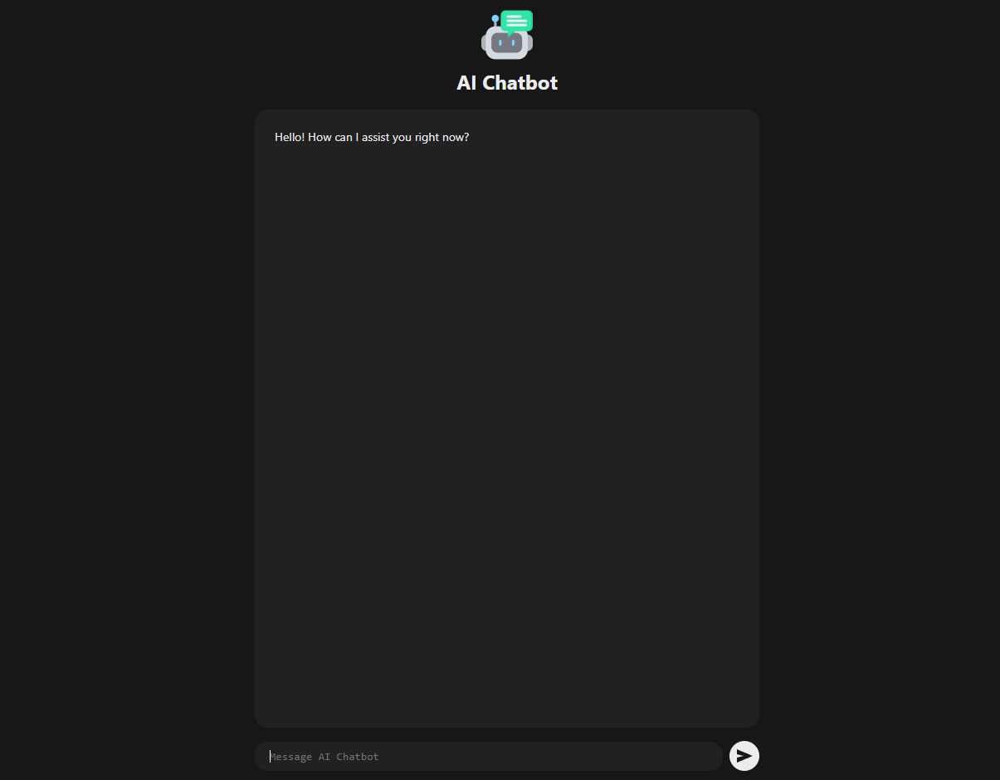

# REACT-AI-CHATBOT

This project is a React application featuring an AI-powered chatbot interface. Users can interact with the chatbot by typing messages, which are processed using Google's AI assistant. The chat history is displayed in real-time, with messages categorized by user, assistant, and system responses. The application includes loading indicators to enhance user experience during AI processing. This project demonstrates the integration of AI capabilities into web applications using modern frontend technologies like React and CSS Modules.

